<!-- ════════════════════════════════════════════════════════════ -->
<!--           ABHIRUP DATTA KHAN · CYBERPUNK PROFILE README      -->
<!-- ════════════════════════════════════════════════════════════ -->

<!-- ① TOP WAVE BANNER -->


<br/>

<!-- ① TYPING SVG -->
<div align="center">
  
</div>

<br/>

<!-- K VISITOR BADGE + IDENTITY PILLS -->
<div align="center">


&nbsp;

&nbsp;


</div>

<br/>

<!-- J CUSTOM CYBERPUNK SVG HEADER -->
<!-- Place header.svg in root of this repo -->
<div align="center">
  
</div>

<br/>

---

## `> whoami`

```txt
╔══════════════════════════════════════════════════════════════════╗
║  NAME     : Abhirup Datta Khan                                   ║
║  ROLE     : UI/UX Designer · Graphic Designer · Frontend Dev     ║
║  STACK    : Design · C/C++ · Java · Python · HTML · CSS          ║
║  LOCATION : India 🇮🇳                                            ║
║  CONTACT  : abhirupdattak6@gmail.com                             ║
║  STATUS   : Open to Collaborate 🟢                               ║
║  FUN FACT : I am funny... 😉😎                                   ║
╚══════════════════════════════════════════════════════════════════╝
```

<br/>

---

## `> skills --list`

### 🎨 Design


### 💻 Languages


### 🛠️ Tools


<br/>

---

## `> competitive --stats`

### 🎯 LeetCode

<div align="center">
  
</div>

<br/>

### 🏆 HackerRank

<div align="center">

[](https://www.hackerrank.com/abhirupdattak6)

</div>

<br/>

---

## `> github --stats`

<div align="center">
  
  
</div>

<br/>

<div align="center">
  
</div>

<br/>

---

## `> achievements --unlock-all`

<div align="center">
  
</div>

<br/>

---

## `> activity --graph`

<div align="center">
  
</div>

<br/>

---

## `> contributions --eat 🐍`

<div align="center">
  <picture>
    <source media="(prefers-color-scheme: dark)"
      srcset="https://raw.githubusercontent.com/abhirup0199/abhirup0199/output/github-contribution-grid-snake-dark.svg"/>
    <source media="(prefers-color-scheme: light)"
      srcset="https://raw.githubusercontent.com/abhirup0199/abhirup0199/output/github-contribution-grid-snake.svg"/>
    
  </picture>
</div>

<details>
<summary>⚙️ Snake Setup — Click to expand</summary>
<br/>

Create this file in your repo: `.github/workflows/snake.yml`

    name: Generate Snake
    on:
      schedule:
        - cron: "0 */12 * * *"
      workflow_dispatch:
    jobs:
      generate:
        runs-on: ubuntu-latest
        steps:
          - uses: Platane/snk/svg-only@v3
            with:
              github_user_name: ${{ github.repository_owner }}
              outputs: |
                dist/github-contribution-grid-snake.svg
                dist/github-contribution-grid-snake-dark.svg?palette=github-dark
          - uses: crazy-max/ghaction-github-pages@v3.1.0
            with:
              target_branch: output
              build_dir: dist
            env:
              GITHUB_TOKEN: ${{ secrets.GITHUB_TOKEN }}

</details>

<br/>

---

## `> joke --random`

<div align="center">
  
</div>

<br/>

---

## `> connect --socials`

<div align="center">

[](https://twitter.com/its_your_adi)
[](https://linkedin.com/in/abhirupdattak11)
[](https://instagram.com/itsyour_adi)
[](https://www.hackerrank.com/abhirupdattak6)
[](https://www.leetcode.com/abhirup11)
[](mailto:abhirupdattak6@gmail.com)
[](https://drive.google.com/file/d/1m2R78Bes8XOdQup8R3Y90pftFgyAKsyg/view?usp=drive_link)

</div>

<br/>

<!-- BOTTOM WAVE -->

